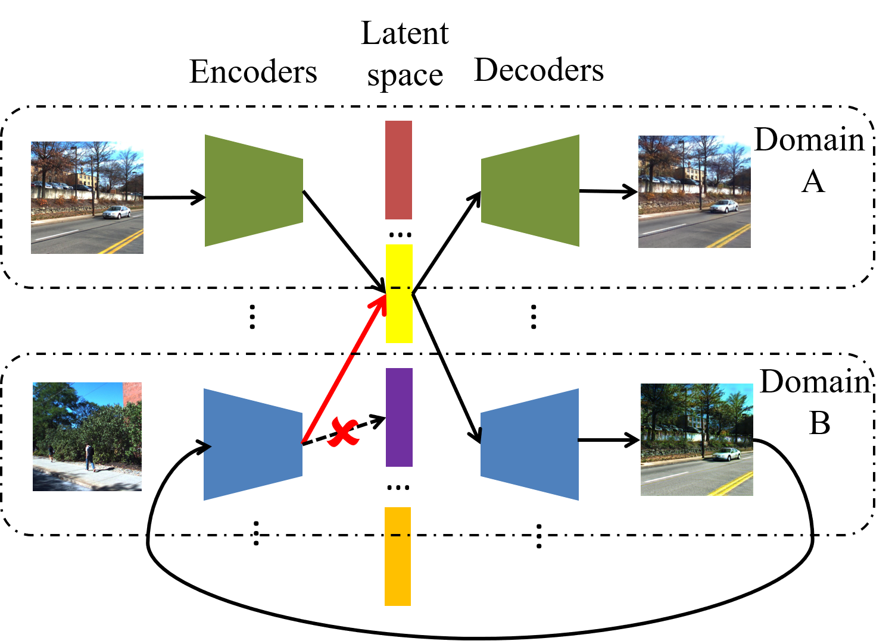
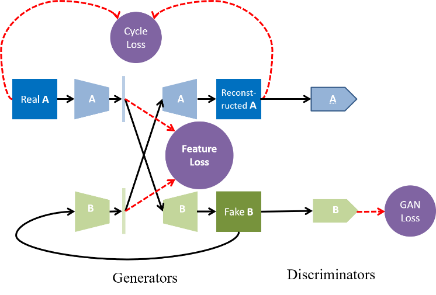
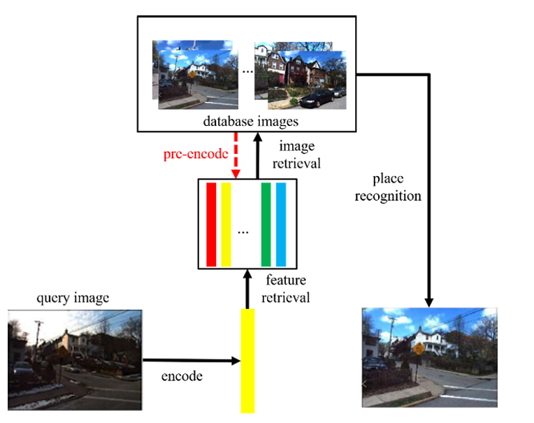

# Domain-Invariant Feature Learning with Feature Consistency Loss (DIFL-FCL)

This is our Pytorch implementation for DIFL-FCL. Code was written by [Hanjiang Hu](https://github.com/HanjiangHu) based on [ComboGAN](https://github.com/AAnoosheh/ComboGAN)

If you use this code in your own work, please cite this paper:

H. Hu, H. Wang, Z. Liu, C. Yang, W. Chen, and L. Xie
”[Retrieval-based Localization Based on Domain-invariant Feature Learning under Changing Environments](https://ieeexplore.ieee.org/document/8968047)”,  
IROS 2019

'''
@INPROCEEDINGS{8968047,  author={H. {Hu} and H. {Wang} and Z. {Liu} and C. {Yang} and W. {Chen} and L. {Xie}},  booktitle={2019 IEEE/RSJ International Conference on Intelligent Robots and Systems (IROS)},  title={Retrieval-based Localization Based on Domain-invariant Feature Learning under Changing Environments},   year={2019},  volume={},  number={},  pages={3684-3689},}
'''


<br><br>

<br><br>



## Prerequisites
- Linux or macOS
- Python 3
- CPU or NVIDIA GPU + CUDA CuDNN

## Getting Started
### Installation
- Install requisite Python libraries.
```bash
pip install torch
pip install torchvision
pip install visdom
pip install dominate
pip install scipy
pip install -U scikit-learn
```
- Clone this repo:
```bash
git clone https://github.com/HanjiangHu/DIFL-FCL.git
```

### Training

The dataset we use in this paper is from CMU-Seasons [HERE](https://www.visuallocalization.net/datasets/). And it is then divided into `CMU_urban`, `CMU_suburban` and `CMU_park` area folders under `./datasets` with different slices. In each area folder, all the images, including both database and query images, are categorized into 12 domains according to 12 environmental conditions, and placed in subfolders from `train00` to `train11` for training. And in order to retrieve images slice by slice while testing, the images of environmental condition X in slice Y are placed in `sY/testXX` as well. The groundtruth poses `pose_new_sY.txt` for database images are already in each slice folder.

Note that the number order of `trainXX` and `testXX` folders is strictly consistent with the environmental condition order introduced in [README_CMU-Seasons.md](https://drive.google.com/drive/folders/1ZF2JmDfTafkS-oUc_7y0GU3QMasu709L), e.g. `train00` and `test00` correspond to the first environmental condition, i.e. the reference condition.

Some of our pretrained models for the CMU-Seasons dataset are found [HERE](https://drive.google.com/file/d/17xLVxUt0WVm97NU6K1frw7go1KjuuNbS/view?usp=sharing). Please uncompress it under the root path. The pretrained models in `cmu_urban`, `cmu_suburban` and `cmu_park` folders under `./checkpoints` are trained with L2-FCL only using images of each area. The urban models at 300 epoch for transfer learning are also given. It is also encouraged to use urban models to test suburban and park images in order to test the generation ability.

Examples:
- Train a model:
```
python train.py --name cmu_urban --dataroot ./datasets/CMU_urban/ --n_domains 12 --niter 300 --niter_decay 300 --display_id 2 
```
Checkpoints will be saved by default to `./checkpoints/cmu_urban/`
- Fine-tuning/Resume training:
```
python train.py --continue_train --which_epoch 300 --name cmu_urban --dataroot ./datasets/CMU_urban/ --n_domains 12 --niter 300 --niter_decay 300  --display_id 2 
```
- Test the model:
```
python test.py --phase test --name cmu_urban --dataroot ./datasets/CMU_urban/ --n_domains 12 --which_epoch 600 --serial_test --gpu_ids 0  --which_slice 2 --test_using_cos
```
The test result will be saved to txt file here: `./results/cmu_urban_600_s2_cos.txt`.


## Training/Testing Details
- See `options/train_options.py` for training-specific flags,`options/test_options.py` for test-specific flags, and `options/base_options.py` for all common flags.
- CPU/GPU (default `--gpu_ids 0`): set`--gpu_ids -1` to use CPU mode; set `--gpu_ids 0,1,2` for multi-GPU mode.
- Visualization: during training the current image translation results and loss plots can be viewed by setting `--display_id` > 0. The results and loss plot will appear on a local graphics web server launched by [visdom](https://github.com/facebookresearch/visdom). To do this, you should have `visdom` installed and a server running by the command `python -m visdom.server`. The default server URL is `http://localhost:8097`. `display_id` corresponds to the window ID that is displayed on the `visdom` server.
- Preprocessing: for training the default option `resize_and_crop` resizes the image such that the largest side becomes `opt.loadSize` and then does a random crop of size `(opt.fineSize, opt.fineSize)`. While testing, images are only resized and not cropped. If `--resize_to_crop_size` option is specified, the image will be resiezed to size `(opt.fineSize, opt.fineSize)`.
- Feature loss metric: set loss weight `--lambda_FCL` to 0 to train without feature loss, otherwise specify `--train_using_cos` to use cosine distance as feature loss instead of L2, and `--test_using_cos` to use cosine similarity for image retrieval instead of L2.
- About PCA: specify `--test_after_pca` to use PCA technique before retrieval, and the default dimension `--PCA_dimension` is 100. Note that since PCA is implemented through `sklearn` module, it takes more time in our demo due to lack of speedup with GPU.


